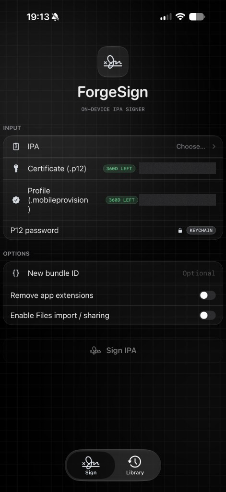
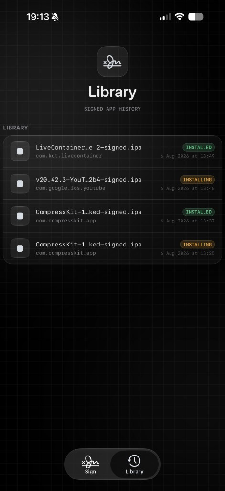
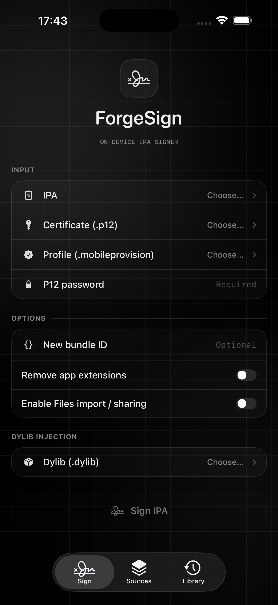
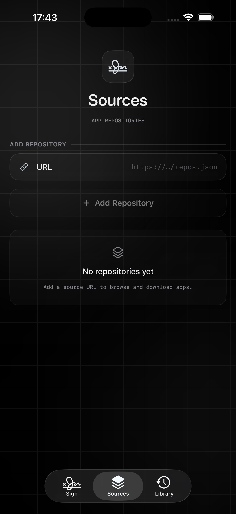
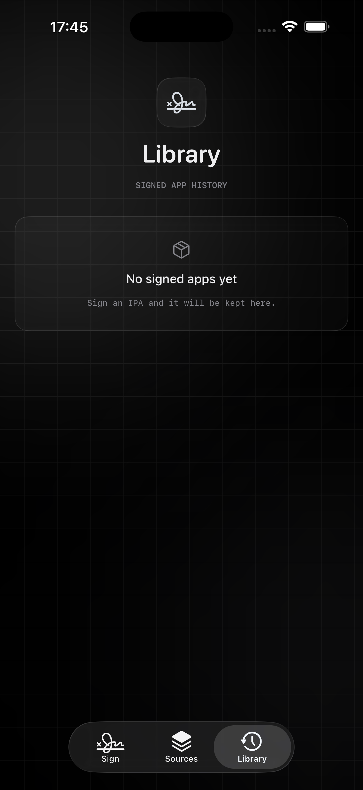

# ForgeSign for iOS

On-device IPA re-signer for iPhone and iPad. Sign and prepare IPAs on-device; installation uses a loopback server and a trusted remote HTTPS manifest, with no certificate or app-content upload.

**[Explore the ForgeSign site](https://mesutcydev.github.io/ForgeSign-iOS/)** · **[Download ForgeSign 1.8](https://github.com/Mesutcydev/ForgeSign-iOS/releases/download/v1.8/ForgeSign-1.8.ipa)**

ForgeSign wraps the battle-tested [zsign](https://github.com/zhlynn/zsign) C++ engine (with a static OpenSSL) in a SwiftUI "liquid glass" interface and adds a complete signing workflow on top of it.

<p align="center">
  
  &nbsp;
  
</p>

<p align="center"><sub>Certificate and provisioning identifiers are redacted in the Sign preview.</sub></p>

## Features

- **Sign IPAs on-device** — pick an `.ipa`, a `.p12` certificate and a `.mobileprovision` profile, optionally rewrite the bundle ID, strip app extensions or enable Files sharing, and sign in seconds with the vendored zsign engine.
- **Remembered certificates** — imported `.p12` files are validated once and stored on-device (Application Support). The last-used certificate is re-selected automatically.
- **Certificate insights** — common name, organization and team ID are parsed from the certificate, and a live countdown pill shows remaining validity (`200d left`, amber under 30 days, red when expired).
- **Keychain passwords** — opt-in password storage only in the device-bound iOS Keychain; if Keychain storage is unavailable, ForgeSign asks for the password again.
- **Install on device** — semi-local OTA install: the IPA is served over loopback HTTP while a trusted remote HTTPS plist (`api.palera.in`) drives `itms-services` directly (Safari is a fallback only). The external manifest service receives install metadata and the local package URL.
- **Library** — a persistent history of every signed app with status (signed / installing / delivered / installed / missing), plus reinstall, share and delete actions.
- **IPA preflight** — package, bundle, encryption and architecture signals are shown before a signing run.
- **Sources** — save repository feeds and hand selected IPA downloads into the normal signing flow.
- **Optional dylib injection** — inject a compatible decrypted dylib into the app, with an opt-in app-extension path, before signing. The original IPA is left untouched.
- **Glass design language** — lighter translucent cards, ambient color blooms, Liquid Glass on iOS 26+ with a material fallback back to iOS 16, light and dark themes.

## Requirements

- Xcode 26+ (the build needs the iOS 26 SDK for the Liquid Glass APIs; deployment target is iOS 16)
- [XcodeGen](https://github.com/yonaskolb/XcodeGen) (`brew install xcodegen`)
- iOS 16.0+ on device

## Build from source

```bash
xcodegen generate
open ForgeSignMobile.xcodeproj
```

Build the `ForgeSignMobile` scheme for a device. Code signing is disabled in the project settings by design — sign the produced app with your own certificate and profile (ForgeSign desktop can do it, or any sideloading tool).

## Sideload the prebuilt IPA

Grab `ForgeSign-1.8.ipa` from [ForgeSign 1.8](https://github.com/Mesutcydev/ForgeSign-iOS/releases/tag/v1.8). The IPA ships **unsigned** — that is the point of the app: sign it like any other IPA.

1. Download the IPA.
2. Sign it with your certificate + provisioning profile — e.g. with ForgeSign (desktop or the iOS app itself), Sideloadly, AltStore or a similar tool.
3. Install the signed IPA on your device.

Only sign and install applications you have the rights to modify. Intended for your own builds and development use.

## What’s new in 1.8

- Fixes the Files picker that opened but let you select nothing on sideloaded builds. The signer now expands a wildcard `application-identifier` (`TEAMID.*`) to the app's concrete bundle id, so iOS gives the app a real identity it can grant file access to instead of a wildcard one.
- The fix runs during signing and is applied per bundle node, so it reaches apps you sign with ForgeSign — not only ForgeSign itself. No-op for concrete (non-wildcard) profiles.
- Document picker simplified to a robust import-mode copy; the deprecated `documentTypes:in:` initializer and custom UTI filter were removed.

## What was new in 1.7

- Uses explicit `UIDocumentPickerMode.import` so sideloaded builds request a local copy instead of opening documents in place.
- Retains concrete `public.data` handling and the explicit IPA, dylib, certificate, and provisioning-profile filename UTIs.
- 1.6 picker metadata, 1.5 sideloaded picker handling, and 1.4 signing hardening are included.

## What was new in 1.6

- Fixed disabled picker items by using the concrete `public.data` import type instead of abstract `public.item`.
- Declared IPA, dylib, certificate, and provisioning-profile filename UTIs in `Info.plist` for Files provider compatibility.

## What was new in 1.5

- Fixed Files picker selection for sideloaded builds by using an unfiltered import-mode picker instead of dynamic extension UTIs.
- IPA, dylib, certificate, and provisioning-profile extensions are validated after selection, then copied into the app container for reliable processing.

## What was new in 1.4

- Fail-closed IPA extraction with archive limits, structural validation, and mandatory post-sign verification.
- Certificate/profile/team/bundle-ID compatibility gates and CMS-verified provisioning profiles.
- Reliable install delivery accounting, exact HTTP ranges, cancellation, Library state parity, and honest `delivered` status.
- Files/Open In routing, HTTPS repository policy, atomic protected persistence, and Keychain-only password storage.
- 1.3 wildcard iCloud entitlement and Files-picker fix retained.

## What was new in 1.3

- Wildcard and placeholder iCloud entitlements are removed before signing so Files document pickers continue working in installed apps.
- Valid iCloud container entitlements are preserved, while the existing document-browser workaround remains in place.
- 1.2 install reliability, staging cleanup, and Sources feed fixes are included.

## What was new in 1.2

- Install server honours HTTP Range requests, so flaky installs resume instead of restarting.
- Silent-audio keep-alive stops as soon as you return without a download, not only after delivery.
- Staged archives are pruned to the current pick and the signing temp folder is wiped on relaunch.
- Sources feeds use stable row identity (refreshes no longer detach in-flight downloads).
- Wildcard-profile iCloud entitlement stripping extended to kvstore/container-environment leftovers.

## What was new in 1.1

- Preflight card for package, bundle, encryption and architecture checks.
- Optional dylib injection with app-extension support for compatible decrypted Mach-O inputs.
- Sources tab with repository feeds and direct IPA handoff.
- Lighter glass surfaces and refreshed dark-mode screens.



 

## How it works

1. Picked files are staged into the app container.
2. The zsign engine (`Bridge/`) re-signs the Mach-O binaries, injects the profile and rewrites metadata, producing `<name>-signed.ipa` in the persistent Signed library.
3. Install serves the IPA on `http://127.0.0.1:<port>`, obtains a trusted HTTPS `manifest.plist` from `api.palera.in` that points at that IPA, then opens `itms-services://` directly so iOS prompts to install.

## Project layout

```
App/            SwiftUI UI (glass design system in App/Design), stores and services
Bridge/         Obj-C++ bridge into the zsign engine
vendor/zsign    Vendored zsign signing engine
vendor/openssl  Static OpenSSL (libcrypto/libssl) for the engine
project.yml     XcodeGen manifest (regenerates the .xcodeproj)
```

## Third-party

- [zsign](https://github.com/zhlynn/zsign) — signing engine (vendored)
- [OpenSSL](https://www.openssl.org) — static cryptography libraries (vendored)
